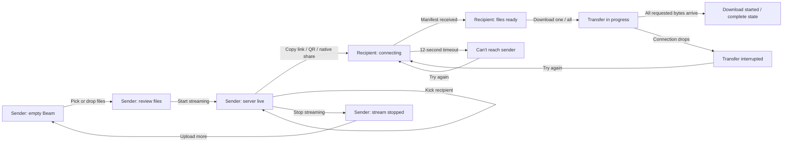

# Beam UI/UX and Product Psychology Study

Status: current implementation study  
Date: 2026-07-15  
Code baseline: `30defad`  
Scope: sender file selection, live Beam hosting, recipient download, visual system, interaction behavior, product psychology, trust, and UX risks.

## 1. One-sentence product model

Beam lets a person select local files, turn the open browser tab into a temporary peer-to-peer file server, share a link or QR code, watch recipients connect and download, modify the available files while live, and shut access off instantly.

The central promise is expressed in two pieces of copy:

- Before starting: **“Unlimited file size! Be the server”**
- While live: **“Your server is live!”**

This is the feature's most important mental model. Beam is not presented as cloud storage or an upload. The sender's device is the source of truth and the open session controls availability.

## 2. Evidence map

The study is based on the current implementation and rendered sender entry screen.

| Concern | Primary implementation |
| --- | --- |
| Sender phase orchestration, tabs, global drop | `src/pages/Home.jsx` |
| Upload box, file list, thumbnails, note | `src/components/BeamUpload.jsx` |
| Sender live UI, recipient UI, progress and failure cards | `src/components/Streaming.jsx` |
| Host state projected into React | `src/hooks/useBeamHost.js` |
| Recipient route and download queue | `src/pages/ReceivePage.jsx` |
| File and folder intake | `src/lib/files.js` |
| WebRTC transfer engine | `src/lib/beam.js` |
| Signaling and ICE/TURN fallback | `src/lib/signaling.js` |
| Screen wake behavior | `src/lib/wakelock.js` |
| Shared shell and visual context | `src/components/Shell.jsx`, `src/index.css` |

Interpretations in the psychology sections are design analysis, not claims explicitly encoded in the source.

## 3. Roles and jobs to be done

### Sender

The sender wants to:

1. Pick one or more files with almost no setup.
2. Understand what will be shared before making it accessible.
3. Create an immediately shareable destination.
4. Know whether anyone connected and whether bytes are moving.
5. Retain control over people, files, speed, and session lifetime.
6. End access decisively.

### Recipient

The recipient wants to:

1. Know whether the link still works.
2. Understand who/what is sharing and what files are available.
3. Download one file or everything.
4. See real progress, speed, and remaining time.
5. Recover from a failed or interrupted connection.

## 4. End-to-end state model

The sender's top-level React phase is deliberately small: `upload`, `live`, or `stopped`. The recipient has `connecting`, `ready`, `done`, `timeout`, `error`, and `interrupted` UI states.

## 5. Sender experience in detail

### 5.1 Empty entry state

The entry card is 280 px wide and sits over a full-bleed Unsplash photograph. Its glass surface uses a translucent white background, a light border, 16 px corner radius, and 16 px backdrop blur.

The card contains:

- Three equal tabs: Drop, Beam, Pool.
- Beam selected by default with a black fill and white icon/text.
- A 142 px dashed drop zone with a stacked-card plus symbol.
- Primary text: “Add files”.
- Supporting promise: “Unlimited file size! Be the server”.
- A persistent black “Start streaming” CTA that is visually dimmed and non-interactive until at least one item exists.

Drop and Pool remain clickable, but their panels are coming-soon placeholders and their CTAs cannot be used. Selecting files always returns the experience to Beam.

### 5.2 File intake

There are two intake paths:

- Clicking the drop zone or “Add more” opens a hidden native multi-file picker.
- Dragging files anywhere over the page activates the Beam drop state; dropping anywhere adds them and selects the Beam tab.

Folder behavior is asymmetric:

- Dropped folders are recursively traversed through the browser entry API and shown as a single top-level folder row.
- The native file picker selects files only; it does not request directory selection.
- During streaming, a folder expands into individually transferred files whose names retain the top-level folder prefix.

Unreadable dropped entries are skipped without failing the full drop. If folder-entry APIs are unavailable, the app falls back to the files exposed by `DataTransfer.files`.

Files are classified as image, video, audio, archive, PDF, document/presentation, spreadsheet, code, text, folder, or generic file. Images receive local previews; videos autoplay as muted looping thumbnails; other types use Lucide icons.

The UI imposes no application-level file-size limit and does not pre-hash the selection before starting. Browser/device memory, disk, network, and platform limits still exist, so “unlimited” is a positioning statement rather than a literal systems guarantee.

### 5.3 Review state

Once at least one item exists, the tabs and large drop zone are replaced by a compact review module:

- Dashed summary header with item count and total bytes.
- “Add more” button.
- Scrollable file list capped at 260 px.
- Soft top/bottom mask fades only when the list can scroll.
- A row for each top-level item with thumbnail/icon, middle-truncated name, size, and remove action.
- Folder rows also show their internal file count.
- Optional note field with a 100-character limit.
- Enabled “Start streaming” CTA.

Items blur/fade into and out of the list while surrounding card height animates. Removing a previewed media item revokes its object URL. The same file may be picked more than once because the native input value is reset after every selection.

### 5.4 Starting Beam

Pressing “Start streaming”:

- Converts UI items into a flat transfer manifest.
- Creates a fresh eight-character Beam ID and peer ID.
- Starts a `BeamHost` WebRTC session.
- Creates the share URL as `current-origin/current-path#/s/{beamId}`.
- Requests a screen wake lock when supported.
- Changes the document title between “Filzy” and “Streaming…” every three seconds.
- Transitions the UI from the upload card to the live two-card layout.

There is no cloud-upload waiting phase. That absence is essential to the product promise: the Beam becomes shareable immediately because the sender's browser is the server.

### 5.5 Live server card

The first live card confirms ownership and availability:

- Pulsing green radio icon.
- “Your server is live!”
- “It's available as long as you run it here”.
- Primary “Copy link” action with 1.5-second “Copied!” confirmation.
- QR toggle.
- When QR is open, native share and close actions appear alongside a large QR code.
- If native sharing is unavailable, Share falls back to copying the link.

The QR is progressive disclosure: it is hidden until requested so the normal copy-link path remains dominant.

### 5.6 Live monitoring and control card

The second live card contains:

- Aggregate transfer speed.
- Connected-recipient count.
- Aggregate progress across recipients currently downloading.
- Either a “Users will appear here” empty state or a scrollable recipient list.
- “Stop streaming” as the main action.
- Settings toggle for file controls and Overdrive.

Each recipient appears as “Anonymous” and moves through these projected states:

| Engine state | UI state | UI treatment |
| --- | --- | --- |
| `reading` | Connected | Green dot and region/locating label |
| `extracting` | Downloading | Per-recipient progress and percentage |
| `complete` | Downloaded | Downloaded confirmation and yellow dot |
| `disconnected` | Offline | Red dot |
| `paused` | Connected | Connected treatment |

The X action on a recipient closes that peer connection and removes the row. The interface therefore gives the sender moderation power, although the icon itself does not explain “kick”.

The settings module lets the sender add or remove files without stopping. Every change rebuilds and rebroadcasts the manifest to connected recipients. It also exposes Overdrive, which removes throttling and increases the buffered high-water mark. Overdrive turns the signal icon and label green, but the UI does not explain its effect or trade-offs.

LAN turbo is a separate, automatic engine optimization for a direct low-latency local-network path. It is intentionally not surfaced in the UI.

### 5.7 Stopping

“Stop streaming” immediately closes the host and signaling connections, clears recipient and speed state, releases the wake lock, and changes the sender view to:

- “Stream stopped!”
- “Nobody can access the files anymore”
- “Upload more”

“Upload more” reloads the page, which resets the entire session rather than returning with the previous selection preserved.

## 6. Recipient experience in detail

### 6.1 Connecting and recovery

Opening a Beam link creates a new receiver, announces it to the host, and shows:

- Spinning loader.
- “Connecting…”
- “Linking you to the sender”.

If no manifest arrives within 12 seconds, the UI changes to “Can't reach the sender” with a possible offline/expired explanation and “Try again”. Separate retryable cards cover a closed connection and a mid-transfer interruption. Retry reloads the page and creates a clean receiver session.

### 6.2 Ready state

When the manifest arrives, the recipient sees:

- “Anonymous is streaming you files!”
- The sender's note, or a default urgency message.
- A row for every advertised file.
- Per-file download affordances.
- A dominant “Download all” CTA.

Live manifest updates replace the visible file list, so sender add/remove actions are reflected without the recipient reopening the link.

### 6.3 Download behavior

Recipient downloads are queued and transferred sequentially over an ordered WebRTC data channel.

For one file:

- Chromium-class browsers with the File System Access API show a save picker and stream bytes directly to disk.
- Other browsers buffer the received chunks into a Blob, then trigger a normal download.

For all files:

- Every advertised file is requested.
- Received files are assembled into `filzy-files.zip` in the browser.
- The card stays visible throughout the transfer.

During transfer, the UI adds:

- Smoothed live receive speed.
- Byte-weighted overall percentage.
- Overall progress bar.
- Estimated time remaining when speed is available.
- Per-file progress bars.
- “Downloading… {percentage}” on the all-files CTA.

The byte-weighted calculation prevents small completed files from creating misleading percentage jumps.

When every advertised file is complete, the recipient sees “Download started” and “Once it's done, go and thank your friend!” The copy is celebratory, although the label describes browser download initiation rather than the network transfer's completed state.

## 7. Technical truth behind the UI

The UI's trust model depends on the following implementation facts:

- File bytes travel through an ordered WebRTC data channel and are DTLS-encrypted in transit.
- Signaling exchanges only connection metadata, not file contents.
- Same-browser connections can signal through `BroadcastChannel`.
- Cross-device signaling prefers the deployed Cloudflare Worker and falls back to one public MQTT broker.
- STUN attempts a direct connection; TURN is added when configured or returned by the signaling worker and is used only when direct peer-to-peer connectivity fails.
- The sender can serve more than one peer and receives progress telemetry at roughly 4 Hz.
- The host reads files in chunks while transferring rather than uploading them in advance.
- The screen wake lock is best effort. The sender still needs to keep the tab/session available.
- The receiver requests approximate city/country from `ipwho.is` and reports it to the sender. This is a third-party network call and a privacy-relevant behavior.
- Buffered recipient downloads can consume substantial memory; direct-to-disk streaming is not available in every browser.

The current interface communicates the temporary-server concept, but it does not surface most of these security, privacy, compatibility, or resource details.

## 8. Visual and interaction system

### 8.1 Palette

The product is primarily monochrome:

| Token | Value | Role |
| --- | --- | --- |
| `text` | `#050505` | Primary text and CTA fill |
| `text-hover` | `#171717` | CTA hover |
| `white` | `#FFFFFF` | Rows and controls |
| `white-hover` | `#F5F5F5` | Row/control hover |
| `bg` | `#F8F9FA` | Inset status/drop surfaces |
| `bg-hover` | `#F2F2F2` | Drag and compact hover feedback |
| `border` | `#DBDEE1` | Structure and progress tracks |
| `alt-text` | `#6F747B` | Secondary content |
| `dalt-text` | `#B7BABE` | Quiet helper copy |

Green communicates live/active/high-performance state, blue is used for active downloading status, yellow for downloaded, and red for offline.

### 8.2 Shape and density

- Outer cards: 16 px radius.
- Main internal panels and rows: roughly 12 px radius.
- Primary CTAs: 11 px radius and 38 px height.
- Secondary compact buttons: 9 px radius and 30–38 px height.
- Repeated 8 px module spacing and 4 px tight-control spacing.
- Sender and recipient cards stay at a narrow 280 px maximum width.

The result resembles a compact native utility rather than a conventional web form.

### 8.3 Typography

- Geist/system sans is the functional typeface.
- Casser serif is reserved for main CTA labels and brand expression.
- Most functional labels are 14 px; metadata is 11–12 px.
- Global tracking is `-0.04em`, creating a dense, editorial feel.

### 8.4 Motion

- Tab content uses a 400 ms blur crossfade.
- Empty/filled upload content swaps with a 200 ms blur fade.
- Major upload/live/stopped phases use a 300 ms blur transition.
- File and user rows animate with opacity and blur plus layout movement.
- Expandable QR and settings content fades upward over 250 ms.
- Card heights animate over 300 ms to avoid abrupt jumps.
- Live radio and downloading dots pulse; connecting uses rotation.

Motion's job is continuity and status, not decoration. However, there is no explicit reduced-motion path.

### 8.5 Responsive behavior

- Mobile: cards are horizontally centered and kept clear of the fixed navbar and bottom credits with top/bottom padding.
- Desktop (`lg`): the experience shifts to a left-aligned position with 128 px left padding.
- Live sender cards stack vertically on smaller screens and sit side by side at `lg`.
- The background selects portrait imagery when the viewport is taller than it is wide and landscape imagery otherwise.

## 9. Product psychology analysis

### 9.1 Agency and ownership

“Be the server” reframes a limitation—the tab must remain open—as personal control. The sender is not waiting for an opaque cloud upload; they create availability and can revoke it. Live file editing, recipient removal, and an explicit stop action reinforce ownership throughout the session.

### 9.2 Immediate reward

There is no upload-progress prelude before the share link appears. The product rewards the sender immediately after one decisive action. This shortens perceived setup cost and supports an “instant utility” identity.

### 9.3 Progressive commitment

The flow asks for only the next necessary decision:

1. Add files.
2. Review and optionally leave a note.
3. Start streaming.
4. Choose link, QR, or native share.
5. Open advanced controls only if needed.

QR, file controls, and Overdrive stay hidden until relevant. This keeps the first-use path calm while preserving expert control.

### 9.4 Visibility reduces uncertainty

Speed, connected count, recipient status, progress bars, percentages, and ETA turn an invisible peer-to-peer process into observable motion. This matters because peer-to-peer transfer has more environmental uncertainty than a familiar cloud upload. The system continuously answers: “Is it connected?”, “Is it moving?”, and “Is it finished?”

### 9.5 Reversibility lowers fear

Before starting, every file can be removed. After starting, files can still be added or removed, recipients can be kicked, and the entire Beam can be stopped. Reversible choices make experimentation feel safer and reduce the cost of a mistaken selection.

### 9.6 Scarcity and urgency

Temporary access creates legitimate urgency: the link works only while the sender runs the Beam. The recipient default note amplifies this with “Access & download now…”. Scarcity can increase action, but aggressive or grammatically weak urgency can also resemble scam language and reduce trust.

### 9.7 Social reciprocity

The completion line asks the recipient to thank their friend. This closes the utility loop with a small social reward for the sender and frames file transfer as a human exchange rather than infrastructure.

### 9.8 Anonymity: less friction, less trust

Every peer is “Anonymous”. This avoids accounts, identity setup, and personal-data collection, but it also makes it harder to verify the sender or recipient. The product currently chooses frictionless access over identity assurance.

### 9.9 Aesthetic contrast

The vivid photography creates emotion and makes the monochrome utility card feel like a small physical object floating in a larger environment. This is memorable and premium, but the background can compete with task focus and produces variable contrast behind translucent cards.

## 10. Current friction, trust, and accessibility risks

These are observations, not implemented changes.

### High priority

1. **Trust is under-explained.** The UI does not say “peer-to-peer”, “encrypted in transit”, “files are not stored by Filzy”, or clearly explain when a relay may be used. For an unfamiliar file link, that omission is costly.
2. **Several visible phrases contain errors.** Current examples include “Comming soon!”, “Keep your device open while transfering”, “Anonymous is streaming you files!”, “before it’s turn off”, and “1 Connected”. These reduce credibility at the exact moments users evaluate trust.
3. **The primary sender CTA is a clickable `div`.** It has no native button semantics, keyboard behavior, disabled state, or accessible name contract.
4. **Removing a recipient is ambiguous.** An unlabeled X looks like dismiss/remove, but actually terminates the peer. It needs an accessible label and preferably a tooltip or clearer action treatment.
5. **Approximate-location reporting is undisclosed.** The recipient contacts a third party and sends its inferred region to the host without UI explanation.

### Medium priority

1. **“Unlimited” is too absolute.** Browser memory, disk, filesystem API support, network policy, and device sleep can limit real transfers.
2. **Overdrive is unexplained.** It implies a dramatic speed increase without clarifying that it only widens buffering and cannot exceed device/network capacity.
3. **No leave/close protection is visible.** Closing, refreshing, or navigating away ends the sender session, yet the UI relies mostly on copy and wake lock rather than a deliberate guard.
4. **The default recipient note uses pressure-heavy language.** Combined with anonymous identity, urgency may trigger phishing heuristics rather than productive action.
5. **“Download started” is semantically late/ambiguous.** It is shown after all advertised files complete at the receiver level; the browser save may already be complete, may only now begin, or may have streamed directly to disk.
6. **Empty live manifest is possible.** A sender can remove every file while live, leaving recipients with a visible but ineffective “Download all” button.
7. **File picker cannot select a directory.** Folder support is discoverable only by drag-and-drop and may vary across browsers.

### Lower priority / polish

1. No explicit `prefers-reduced-motion` treatment is present.
2. Compact 24 px icon actions are below common 44 px touch-target guidance.
3. Focus-visible treatments are not deliberately designed.
4. Meaning relies partly on green/yellow/red color, although labels reduce this risk.
5. Video thumbnails autoplay, which may add motion and resource cost in long lists.
6. The README still describes an early starter rather than the current product.

## 11. Recommended UX direction

### P0: preserve the core model

Do not lose these qualities in future redesigns:

- The immediate “no cloud upload” start.
- Sender control over lifetime, files, and recipients.
- Visible live progress on both sides.
- The compact one-task-at-a-time interface.
- Link, QR, and native share as complementary paths.

### P1: strengthen trust before adding more features

- Add a concise pre-start trust line such as “Peer-to-peer • nothing stored by Filzy”.
- Add an expandable explanation covering encryption, relay fallback, tab lifetime, and browser/device limits.
- Disclose approximate region lookup or remove it.
- Replace “unlimited” with an accurate benefit such as “No Filzy file-size cap”.
- Repair all visible grammar and pluralization.
- Give kick, remove, settings, QR, share, and close actions explicit accessible labels.
- Make Start streaming a real `<button disabled>`.

### P2: clarify live-session responsibility

- Warn before refresh/close while a Beam is live.
- Explain Overdrive inline: “Uses more memory to keep fast links saturated”.
- Show a clear direct/relay connection explanation only if it can be truthful and understandable.
- Disable or replace “Download all” when the manifest is empty.
- Let the sender name the Beam or display a short recognizable sender label if identity remains optional.

### P3: refine finish states

- Separate “Transfer complete”, “Saved to disk”, and “Browser download started” where the platform allows it.
- Preserve a receipt-like list of downloaded files until the recipient leaves.
- Offer a sender-side success summary before stopping: recipients served, bytes transferred, and session duration.

## 12. Copy repair reference

| Current | Suggested |
| --- | --- |
| `Comming soon!` | `Coming soon!` |
| `Unlimited file size! Be the server` | `No Filzy file-size cap. Your device is the server.` |
| `It's available as long as you run it here` | `Available while this tab stays open.` |
| `Keep your device open while transfering` | `Keep this tab open while transferring.` |
| `1 Connected` | `1 connected` |
| `Anonymous is streaming you files!` | `Anonymous is streaming files to you.` |
| `Access & download now, before it’s turn off` | `Download before the sender closes this Beam.` |
| `Nobody can access the files anymore` | `This link can no longer access your files.` |
| `Once it's done, go and thank your friend!` | `Transfer complete. Go thank your friend!` |

## 13. Regression checklist for future Beam work

### File intake

- Multi-file picker adds all chosen files.
- Picking the same file twice remains possible.
- Page-wide drag state appears and clears after drop, leave, cancel, and Escape.
- Loose files and nested folders are collected correctly.
- Unreadable folder entries do not cancel valid entries.
- Image/video object URLs are revoked after removal and unmount.
- Long names preserve the final seven characters.
- Item count, folder count, and byte totals remain correct.
- List masks appear only when scrolling is possible.

### Sender live state

- A non-empty selection creates exactly one new Beam session.
- Copy, QR, native share, and native-share fallback work.
- Screen wake lock is requested and released correctly.
- Live title flashing starts and stops with the Beam.
- Multiple recipients appear, update, finish, disconnect, and can be removed.
- Aggregate speed returns to zero when transfers become idle.
- Files added/removed while live update every recipient manifest.
- Removing all files has a defined UI state.
- Overdrive changes engine configuration and has truthful visible feedback.
- Stop closes access and reaches the stopped screen.

### Recipient

- Connecting transitions to ready when the manifest arrives.
- Timeout appears after 12 seconds and retry creates a clean connection.
- Sender stop, connection close, and mid-transfer drop use the correct failure state.
- Single downloads work with direct-to-disk and buffered fallback.
- Download all produces a valid zip and handles duplicate file names intentionally.
- Per-file and aggregate progress are byte-accurate.
- Speed and ETA do not stick after completion.
- Manifest changes do not corrupt an in-progress queue.
- Completion copy matches whether data is saved or merely handed to the browser.

### Accessibility and responsive behavior

- All actions are keyboard reachable and have accessible names.
- Disabled states are programmatic, not only visual.
- Focus remains logical when QR/settings panels open or close.
- Touch targets remain usable on a 390 px viewport.
- Live cards stack without hiding the navbar or credits.
- Long file names, large byte values, and translated copy do not overflow.
- Reduced-motion users receive non-animated equivalents.

## 14. Product essence to retain

Beam works because it makes the sender feel three things at once:

1. **Fast:** there is no cloud-upload wait before sharing.
2. **In control:** the sender decides the files, people, performance mode, and endpoint.
3. **Certain:** both sides can see whether the transfer is connected, moving, finished, or broken.

Future UI decisions should be tested against those three feelings. If a change adds capability but makes Beam feel slower, less controllable, or less observable, it weakens the feature's core psychology.
